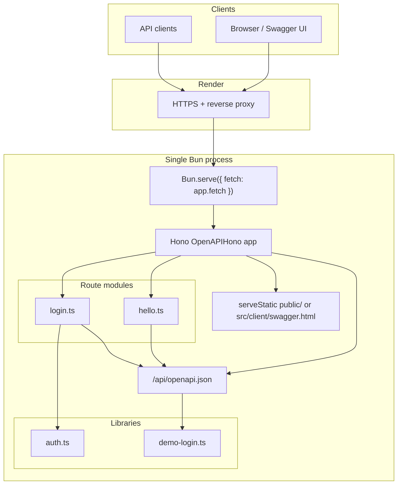
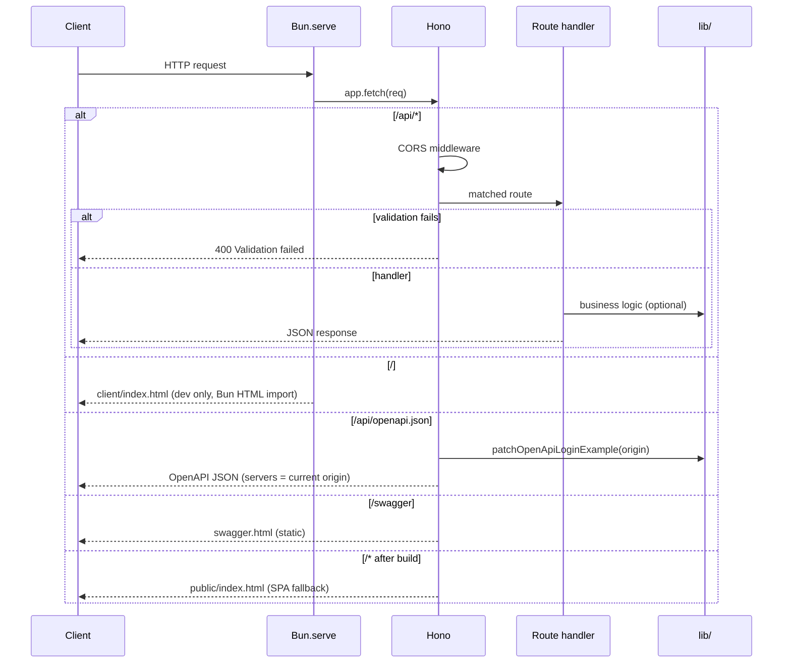
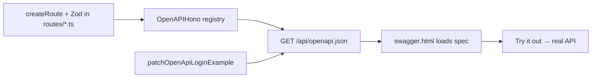
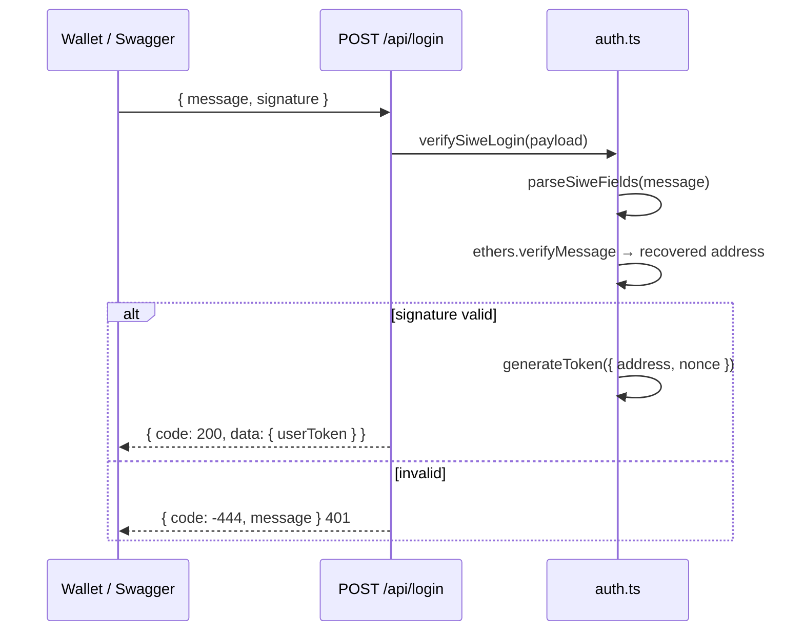
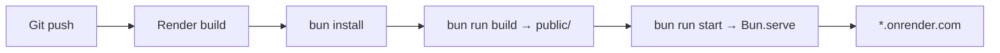

# Architecture

Ethan DApp Server is a Bun full-stack application: a single process serves the Hono API, Swagger UI, and (after build) a React SPA.

## Stack

| Layer | Technology | Role |
| --- | --- | --- |
| Runtime | [Bun](https://bun.sh) | HTTP server, bundler, package manager |
| HTTP entry | `Bun.serve` | Listen on `PORT`, delegate to Hono `fetch` |
| App framework | [Hono](https://hono.dev) | Routing, middleware, JSON, static files |
| API + docs | [@hono/zod-openapi](https://github.com/honojs/middleware/tree/main/packages/zod-openapi) | Route definition, Zod validation, OpenAPI generation |
| Auth | SIWE + ethers + jsonwebtoken | Wallet sign-in, JWT session token |
| Frontend | React 19 | Optional SPA in `public/` after `bun run build` |
| Deploy | [Render](https://render.com) | Bun Web Service via `render.yaml` |

## High-level diagram



## Request flow



## Directory layout

```
ethan-dapp-server/
├── src/
│   ├── client/               # React SPA + Swagger UI (bundled to public/)
│   │   ├── index.html
│   │   ├── swagger.html      # Swagger UI shell (dev fallback)
│   │   ├── frontend.tsx
│   │   ├── App.tsx
│   │   └── ...
│   └── server/               # Bun.serve + Hono API
│       ├── index.ts          # Entry: Bun.serve
│       ├── server.ts         # Hono app assembly
│       ├── config.ts         # Env: JWT_SECRET_KEY, JWT_EXPIRES
│       ├── routes/           # One module per API area
│       │   ├── index.ts      # registerAllRoutes
│       │   ├── hello.ts
│       │   ├── login.ts
│       │   └── me.ts
│       └── lib/
│           ├── auth.ts
│           ├── auth-middleware.ts
│           ├── demo-login.ts
│           ├── openapi-patches.ts
│           └── openapi-security.ts
├── public/                   # Created by bun run build
├── render.yaml
└── develop/
```

## Layer responsibilities

### `src/server/index.ts` — process entry

- Reads `PORT` (Render injects this in production).
- Calls `Bun.serve({ port, fetch: app.fetch })`.
- **Dev only:** `routes: { "/": clientIndex }` — Bun bundles `src/client/index.html` with HMR.
- **Prod:** no `routes`; home and Swagger are served by Hono from `public/`.

### `src/server/server.ts` — application shell

- Instantiates `OpenAPIHono` with a global validation hook (400 on Zod failure).
- Calls `registerAllRoutes(app)` from `routes/index.ts`.
- Applies CORS on `/api/*`.
- Serves `/api/openapi.json` with dynamic `servers[0].url` from `requestOrigin()` (reads `X-Forwarded-Proto` / `Host` for Render HTTPS).
- Serves Swagger and SPA static files.

### `src/server/routes/*.ts` — API modules

Each module owns:

1. Zod schemas (with `.openapi()` metadata)
2. `createRoute(...)` definition
3. `registerXxxRoutes(app)` that calls `app.openapi(route, handler)`

Adding an API = new file + one line in `routes/index.ts`. See [add-api.md](./add-api.md).

### `src/server/lib/` — shared domain logic

| Module | Purpose |
| --- | --- |
| `auth.ts` | Parse SIWE message, verify signature via `ethers.verifyMessage`, issue/verify JWT |
| `auth-middleware.ts` | `requireAuth` — reads `Authorization` header (Bearer optional) |
| `demo-login.ts` | Process-local random wallet; builds valid SIWE payload for Swagger Try it out |

## OpenAPI and Swagger



**Why this matters**

- Route, validation, and documentation are defined once — no hand-maintained `openapi.json`.
- `servers` URL is computed per request so Swagger on Render uses `https://`, avoiding mixed-content errors.
- Login endpoint gets a **live** `message` + `signature` example tied to the current host (demo wallet, random nonce).

## Authentication flow



- **SIWE (EIP-4361)** message format; signature checked with ethers (not the `siwe` verify path at runtime).
- **JWT** signed with `JWT_SECRET_KEY`; expiry from `JWT_EXPIRES` (default `7d`).
- Protected example: `GET /api/me` uses `requireAuth` — pass `Authorization: Bearer <userToken>`.

## Static assets

| Path | Source | When |
| --- | --- | --- |
| `/` | `src/client/index.html` (Bun HTML import) | Dev (`bun dev`) |
| `/` | `public/index.html` | Prod after `bun run build` |
| `/swagger` | `public/swagger.html` | Prod after build |
| `/swagger` | `src/client/swagger.html` | Dev / no build |
| `/logo.svg` | `src/client/logo.svg` or `public/logo.svg` | Favicon for home & Swagger |

`src/client/swagger.html` loads Swagger UI from unpkg CDN and reads `/api/openapi.json`.

`bun run build` bundles React from `src/client/index.html` into `public/`, and copies `swagger.html` + `logo.svg` to `public/`.

## Deployment (Render)



| Setting | Value |
| --- | --- |
| Runtime | `bun` |
| Build | `bun install && bun run build` |
| Start | `bun run start` |
| Secrets | `JWT_SECRET_KEY` in dashboard (`sync: false` in blueprint) |

See [deploy-render.md](./deploy-render.md) for setup steps.

## Design decisions

| Decision | Rationale |
| --- | --- |
| Bun.serve + Hono | Bun handles I/O; Hono handles routing/OpenAPI without a heavy framework |
| @hono/zod-openapi | Swagger is required; schema and docs stay in sync with minimal boilerplate |
| Route modules under `src/server/routes/` | Clear boundary; `server.ts` stays a wiring layer |
| Lazy `import()` in login handler | Keeps cold start reasonable; defers ethers/auth until needed |
| Demo wallet in `demo-login.ts` | Swagger Try it out works without a real wallet; clearly not for production auth |
| `requestOrigin()` helper | Correct OpenAPI base URL behind Render TLS termination |
| Single service on Render | API + Swagger + SPA in one Web Service; simpler ops and cost |

## Extension points

- **New API**: add `src/server/routes/foo.ts`, register in `routes/index.ts` — appears in Swagger automatically.
- **Protected routes**: use `requireAuth` middleware; see `routes/me.ts`.
- **More env config**: extend `src/server/config.ts`; document in `.env.example`.

## Related docs

| Doc | Topic |
| --- | --- |
| [add-api.md](./add-api.md) | Adding endpoints |
| [deploy-render.md](./deploy-render.md) | Production deploy |
| [../README.md](../README.md) | Quick start and scripts |
