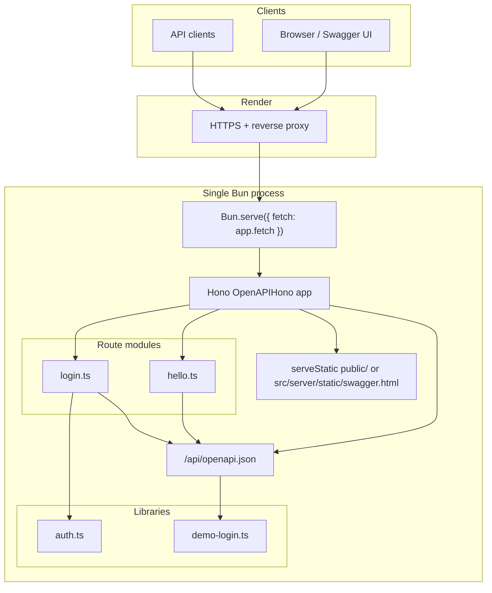
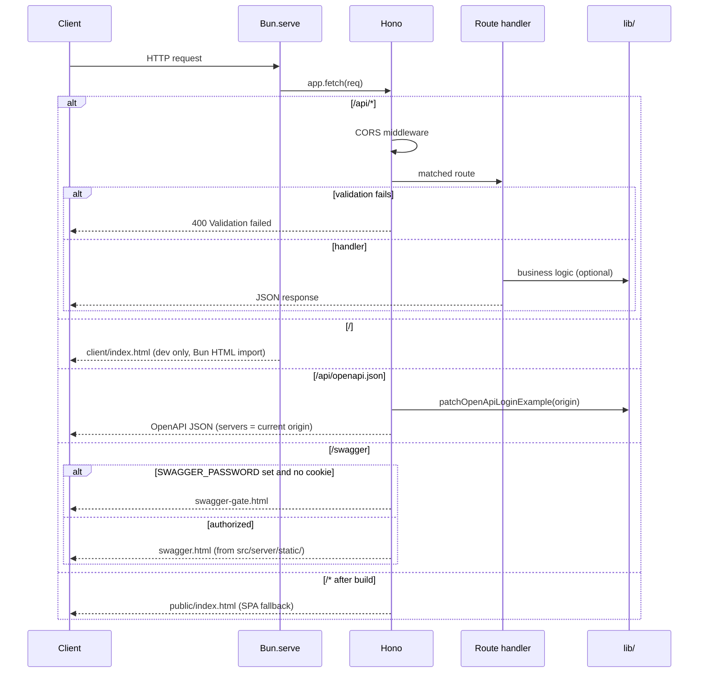
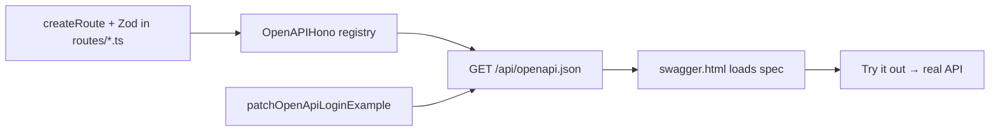
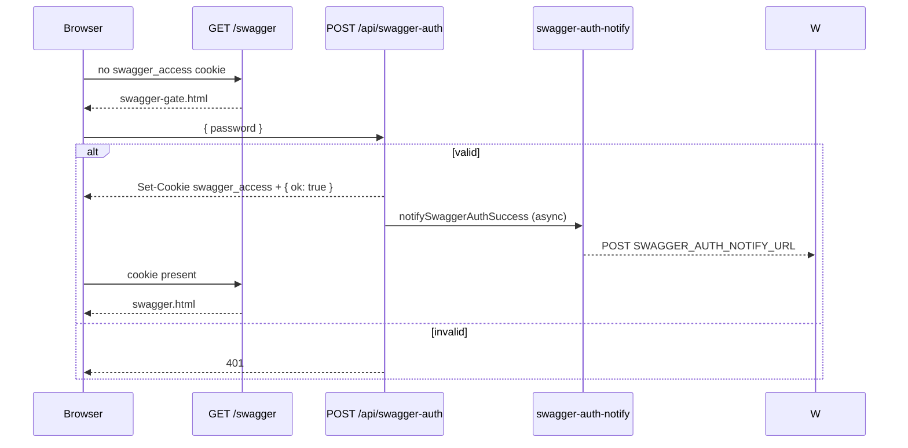
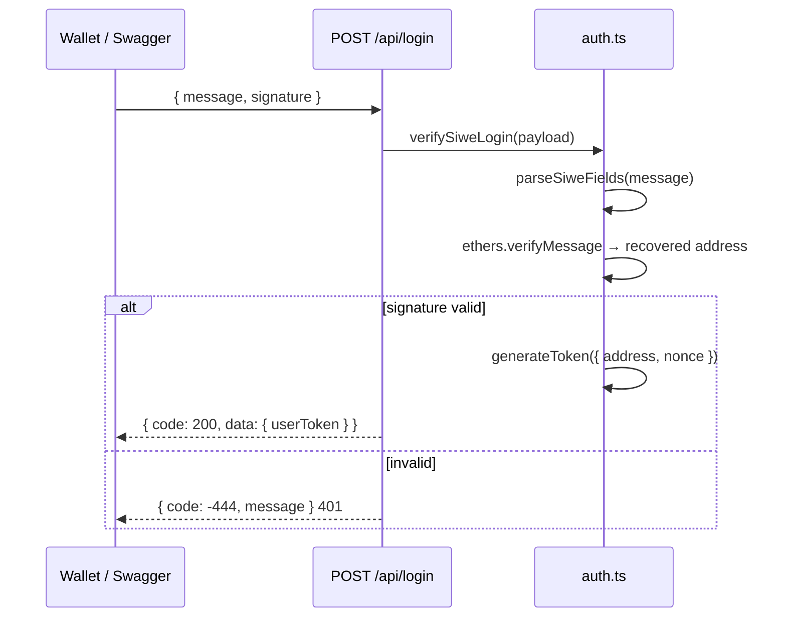
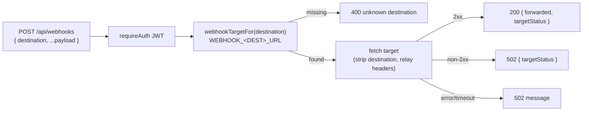
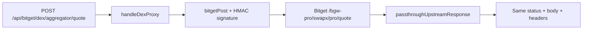
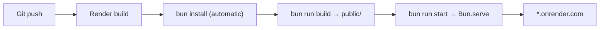

# Architecture

Ethan DApp Server is a Bun full-stack application: a single process serves the Hono API, Swagger UI, and (after build) a React SPA.

## Stack

| Layer | Technology | Role |
| --- | --- | --- |
| Runtime | [Bun](https://bun.sh) | HTTP server, bundler, package manager |
| HTTP entry | `Bun.serve` | Listen on `PORT`, delegate to Hono `fetch` |
| App framework | [Hono](https://hono.dev) | Routing, middleware, JSON, static files |
| API + docs | [@hono/zod-openapi](https://github.com/honojs/middleware/tree/main/packages/zod-openapi) | Route definition, Zod validation, OpenAPI generation |
| Auth | SIWE + ethers + jsonwebtoken | Wallet sign-in, JWT session token |
| Frontend | React 19 | Optional SPA in `public/` after `bun run build` |
| Deploy | [Render](https://render.com) | Bun Web Service via `render.yaml` |

## High-level diagram


```mermaid
flowchart TB
  subgraph clients [Clients]
    Browser[Browser / Swagger UI]
    APIClient[API clients]
  end

  subgraph render [Render]
    TLS[HTTPS + reverse proxy]
  end

  subgraph process [Single Bun process]
    BunServe["Bun.serve({ fetch: app.fetch })"]
    Hono[Hono OpenAPIHono app]

    subgraph routes [Route modules]
      Hello[hello.ts]
      Login[login.ts]
    end

    subgraph lib [Libraries]
      Auth[auth.ts]
      DemoLogin[demo-login.ts]
    end

    Static[serveStatic public/ or src/server/static/swagger.html]
    OpenAPI["/api/openapi.json"]
  end

  Browser --> TLS
  APIClient --> TLS
  TLS --> BunServe
  BunServe --> Hono
  Hono --> Hello
  Hono --> Login
  Hono --> Static
  Hono --> OpenAPI
  Login --> Auth
  OpenAPI --> DemoLogin
  Hello --> OpenAPI
  Login --> OpenAPI
```

## Request flow


```mermaid
sequenceDiagram
  participant C as Client
  participant B as Bun.serve
  participant H as Hono
  participant R as Route handler
  participant L as lib/

  C->>B: HTTP request
  B->>H: app.fetch(req)
  alt /api/*
    H->>H: CORS middleware
    H->>R: matched route
    alt validation fails
      H-->>C: 400 Validation failed
    else handler
      R->>L: business logic (optional)
      R-->>C: JSON response
    end
  else /
    B-->>C: client/index.html (dev only, Bun HTML import)
  else /api/openapi.json
    H->>L: patchOpenApiLoginExample(origin)
    H-->>C: OpenAPI JSON (servers = current origin)
  else /swagger
    alt SWAGGER_PASSWORD set and no cookie
      H-->>C: swagger-gate.html
    else authorized
      H-->>C: swagger.html (from src/server/static/)
    end
  else /* after build
    H-->>C: public/index.html (SPA fallback)
  end
```

## Directory layout

```
ethan-dapp-server/
├── src/
│   ├── client/               # React SPA (bundled to public/)
│   │   ├── index.html
│   │   ├── frontend.tsx
│   │   ├── App.tsx
│   │   └── ...
│   └── server/               # Bun.serve + Hono API
│       ├── index.ts          # Entry: Bun.serve
│       ├── server.ts         # Hono app assembly
│       ├── static/
│       │   ├── swagger.html       # Swagger UI shell
│       │   └── swagger-gate.html  # Password gate page
│       ├── config.ts         # Env: JWT_SECRET_KEY, JWT_EXPIRES, WEBHOOK_*
│       ├── routes/           # One module per API area
│       │   ├── index.ts      # registerAllRoutes
│       │   ├── health.ts
│       │   ├── hello.ts
│       │   ├── login.ts
│       │   ├── me.ts
│       │   └── webhooks.ts
│       └── lib/
│           ├── auth.ts
│           ├── auth-middleware.ts
│           ├── demo-login.ts
│           ├── ip-country.ts
│           ├── openapi-patches.ts
│           ├── openapi-security.ts
│           ├── request-client.ts
│           ├── swagger-auth-notify.ts
│           ├── swagger-gate.ts
│           └── webhook-forward.ts
├── public/                   # Created by bun run build
├── render.yaml
└── develop/
```

## Layer responsibilities

### `src/server/index.ts` — process entry

- Reads `PORT` (default `3000` in dev, `3001` for `bun run start`; Render injects `PORT` in production).
- Calls `Bun.serve({ port, fetch })` and passes the Bun `server` into Hono (`SERVER` binding) so handlers can read `server.requestIP(req)`.
- **Dev only:** `routes: { "/": clientIndex }` — Bun bundles `src/client/index.html` with HMR.
- **Prod:** no `routes`; home and SPA assets are served by Hono from `public/`.

### `src/server/server.ts` — application shell

- Instantiates `OpenAPIHono` with a global validation hook (400 on Zod failure).
- Calls `registerAllRoutes(app)` from `routes/index.ts`.
- Applies CORS on `/api/*`.
- Serves `/api/openapi.json` with dynamic `servers[0].url` from `requestOrigin()` (reads `X-Forwarded-Proto` / `Host` for Render HTTPS).
- Serves Swagger from `src/server/static/` (always, dev and prod).
- Optional Swagger password gate when `SWAGGER_PASSWORD` is set (`POST /api/swagger-auth`, HttpOnly cookie).
- On successful Swagger login, optional server-side notify to `SWAGGER_AUTH_NOTIFY_URL` (IP, geo, IP type, ISP; fire-and-forget).
- Serves SPA static files from `public/` in production.

### `src/server/routes/*.ts` — API modules

Each module owns:

1. Zod schemas (with `.openapi()` metadata)
2. `createRoute(...)` definition
3. `registerXxxRoutes(app)` that calls `app.openapi(route, handler)`

Adding an API = new file + one line in `routes/index.ts`. See [add-api.md](./add-api.md).

### `src/server/lib/` — shared domain logic

| Module | Purpose |
| --- | --- |
| `auth.ts` | Parse SIWE message, verify signature via `ethers.verifyMessage`, issue/verify JWT |
| `auth-middleware.ts` | `requireAuth` — reads `Authorization` header (Bearer optional) |
| `demo-login.ts` | Process-local random wallet; builds valid SIWE payload for Swagger Try it out |
| `request-client.ts` | Client IP (`X-Forwarded-For` → Bun `requestIP`) and request metadata |
| `ip-country.ts` | Country (full name), city/region, VPN/datacenter hints via `ipwho.is` + heuristics |
| `swagger-auth-notify.ts` | Server-side Swagger login webhook notify |
| `swagger-gate.ts` | Optional `/swagger` password gate; HMAC-signed `swagger_access` cookie (24h) |
| `webhook-forward.ts` | Internal JSON POST helper for notify |

## OpenAPI and Swagger


```mermaid
flowchart LR
  A["createRoute + Zod in routes/*.ts"] --> B[OpenAPIHono registry]
  B --> C["GET /api/openapi.json"]
  D[patchOpenApiLoginExample] --> C
  C --> E[swagger.html loads spec]
  E --> F[Try it out → real API]
```

**Why this matters**

- Route, validation, and documentation are defined once — no hand-maintained `openapi.json`.
- `servers` URL is computed per request so Swagger on Render uses `https://`, avoiding mixed-content errors.
- Login endpoint gets a **live** `message` + `signature` example tied to the current host (demo wallet, random nonce).

### Swagger UI (`src/server/static/swagger.html`)

- Loads spec from `/api/openapi.json` (public; not behind the Swagger password gate).
- **Standalone layout** with built-in dark-mode toggle; preference persisted in `localStorage` (`swagger-ui-theme`).
- Bottom **Schemas** section kept but collapsed by default (`defaultModelsExpandDepth: 0`).

### Swagger password gate

When `SWAGGER_PASSWORD` is set:


```mermaid
sequenceDiagram
  participant B as Browser
  participant S as GET /swagger
  participant A as POST /api/swagger-auth
  participant N as swagger-auth-notify

  B->>S: no swagger_access cookie
  S-->>B: swagger-gate.html
  B->>A: { password }
  alt valid
    A-->>B: Set-Cookie swagger_access + { ok: true }
    A->>N: notifySwaggerAuthSuccess (async)
    N-->>W: POST SWAGGER_AUTH_NOTIFY_URL
    B->>S: cookie present
    S-->>B: swagger.html
  else invalid
    A-->>B: 401
  end
```

- `/api/*` (including `/api/openapi.json`) stays **public** — only the HTML UI is gated.
- Cookie is HttpOnly, SameSite=Lax, 24h; value is HMAC(password, `"granted"`).
- Unset `SWAGGER_PASSWORD` → gate disabled, `/swagger` serves UI directly.

### Swagger login notify

When `SWAGGER_AUTH_NOTIFY_URL` is set, a successful `POST /api/swagger-auth` triggers a **server-side** JSON POST (not from the browser). The response to the client is not blocked if notify fails.

Payload fields include:

| Field | Source |
| --- | --- |
| `ip` | `X-Forwarded-For` / `X-Real-IP` / Bun `server.requestIP()` |
| `country` | `CF-IPCountry` (etc.) → full name e.g. `Singapore (SG)`; `Local` for loopback |
| `region`, `city`, `location` | `ipwho.is` geolocation (city + region summary line) |
| `connectionOrg` | ISP / org from `ipwho.is` (e.g. `FDCservers.net`) |
| `security` | VPN/proxy/hosting/Tor flags + plain `label` (e.g. `Likely VPN or server IP (datacenter, not home broadband)`) |
| `userAgent`, `referer`, `host`, `timestamp` | Request headers |
| `content` | Human-readable summary for Discord etc. (`IP type:` line replaces opaque risk codes) |

IP geolocation reflects the **exit IP** (VPN/datacenter shows the node location, not the user's true address).

| Env | Default | Role |
| --- | --- | --- |
| `SWAGGER_AUTH_NOTIFY_URL` | unset | Webhook target URL |
| `TIMEOUT_MS` | `5000` | Shared outbound timeout (notify, webhooks, DEX proxy, IP lookup) |

Local dev: loopback Swagger login skips notify when `NODE_ENV=development` (still notifies in test/production). Discord URLs may time out without access to `discord.com` — login still succeeds; leave `SWAGGER_AUTH_NOTIFY_URL` unset locally if not needed.

## Authentication flow


```mermaid
sequenceDiagram
  participant W as Wallet / Swagger
  participant API as POST /api/login
  participant Auth as auth.ts

  W->>API: { message, signature }
  API->>Auth: verifySiweLogin(payload)
  Auth->>Auth: parseSiweFields(message)
  Auth->>Auth: ethers.verifyMessage → recovered address
  alt signature valid
    Auth->>Auth: generateToken({ address, nonce })
    API-->>W: { code: 200, data: { userToken } }
  else invalid
    API-->>W: { code: -444, message } 401
  end
```

- **SIWE (EIP-4361)** message format; signature checked with ethers (not the `siwe` verify path at runtime).
- **JWT** signed with `JWT_SECRET_KEY`; expiry from `JWT_EXPIRES` (default `7d`).
- Protected example: `GET /api/me` uses `requireAuth` — pass `Authorization: Bearer <userToken>`.

## Webhook relay

`POST /api/webhooks` (JWT-protected) routes an inbound payload by its `destination` field to a per-destination target URL.


```mermaid
flowchart LR
  C["POST /api/webhooks<br/>{ destination, ...payload }"] --> A[requireAuth JWT]
  A --> R["webhookTargetFor(destination)<br/>WEBHOOK_&lt;DEST&gt;_URL"]
  R -->|missing| E400[400 unknown destination]
  R -->|found| F["fetch target<br/>(strip destination, relay headers)"]
  F -->|2xx| OK["200 { forwarded, targetStatus }"]
  F -->|non-2xx| E502["502 { targetStatus }"]
  F -->|error/timeout| E502b[502 message]
```

- **Routing**: `destination` resolves to env var `WEBHOOK_<DESTINATION>_URL` (e.g. `discord` → `WEBHOOK_DISCORD_URL`); adding a destination needs only a new env var.
- **Forwarded body**: all fields except `destination`.
- **Headers**: upstream headers relayed, except hop-by-hop headers and the JWT `Authorization` (not leaked to the target).
- **Result**: target `2xx` → `200` with `targetStatus`; non-2xx or unreachable → `502`.
- **Timeout**: shared `TIMEOUT_MS` (default `5000`).

## DEX aggregator proxies

Transparent signed proxies to external DEX APIs. Credentials stay server-side; clients call local routes only.


```mermaid
flowchart LR
  C["POST /api/bitget/dex/aggregator/quote"] --> H[handleDexProxy]
  H --> S[bitgetPost + HMAC signature]
  S --> U["Bitget /bgw-pro/swapx/pro/quote"]
  U --> P[passthroughUpstreamResponse]
  P --> R["Same status + body + headers"]
```

| Layer | Path | Role |
| --- | --- | --- |
| Shared | `lib/dex/proxy.ts` | Validate body, call provider client, passthrough or 502/503 |
| Provider | `lib/dex/providers/bitget/` | Config, HMAC client, request/response OpenAPI schemas |
| Routes | `routes/dex/bitget.ts` | `createRoute` + `registerDexProxyRoute` |
| Registry | `routes/dex/index.ts` | `registerDexRoutes()` — Bitget today, OKX stub |

**Bitget routes**

| Local | Upstream | Purpose |
| --- | --- | --- |
| `POST /api/bitget/dex/aggregator/quote` | `/bgw-pro/swapx/pro/quote` | Quote |
| `POST /api/bitget/dex/aggregator/swap` | `/bgw-pro/swapx/pro/swap` | Calldata / swap build |

Env: `BITGET_API_URL`, `BITGET_API_KEY`, `BITGET_API_SECRET`.

To add OKX or another provider, see [add-dex-provider.md](./add-dex-provider.md).

## Static assets

| Path | Source | When |
| --- | --- | --- |
| `/` | `src/client/index.html` (Bun HTML import) | Dev (`bun dev`) |
| `/` | `public/index.html` | Prod after `bun run build` |
| `/swagger` | `src/server/static/swagger.html` | Always (dev and prod) |
| `/swagger` (gate) | `src/server/static/swagger-gate.html` | When `SWAGGER_PASSWORD` is set and no valid cookie |

`bun run build` bundles React from `src/client/index.html` into `public/` (favicon via bundled asset). Swagger HTML is **not** copied to `public/` — Hono serves it from `src/server/static/` at runtime.

## Deployment (Render)


```mermaid
flowchart LR
  Git[Git push] --> Render[Render build]
  Render --> Install["bun install (automatic)"]
  Install --> Build["bun run build → public/"]
  Build --> Start["bun run start → Bun.serve"]
  Start --> Live["*.onrender.com"]
```

| Setting | Value |
| --- | --- |
| Service name | `ethan-dapp` (blueprint) |
| Runtime | `bun` |
| Build | `bun run build` (do not chain `bun install &&` — Render truncates `&&`) |
| Start | `bun run start` |
| Secrets | `JWT_SECRET_KEY`, optional `SWAGGER_PASSWORD` in dashboard (`sync: false` in blueprint) |

See [deploy-render.md](./deploy-render.md) for setup steps.

## Design decisions

| Decision | Rationale |
| --- | --- |
| Bun.serve + Hono | Bun handles I/O; Hono handles routing/OpenAPI without a heavy framework |
| @hono/zod-openapi | Swagger is required; schema and docs stay in sync with minimal boilerplate |
| Route modules under `src/server/routes/` | Clear boundary; `server.ts` stays a wiring layer |
| Lazy `import()` in login handler | Keeps cold start reasonable; defers ethers/auth until needed |
| Demo wallet in `demo-login.ts` | Swagger Try it out works without a real wallet; clearly not for production auth |
| Swagger from `src/server/static/` | Docs shell stays in source tree; no copy step in build |
| Optional `SWAGGER_PASSWORD` gate | Protects Swagger UI HTML only; API and OpenAPI JSON remain public for clients |
| Server-side Swagger login notify | Audit/alert on docs access without exposing webhook URL to the browser |
| `requestOrigin()` helper | Correct OpenAPI base URL behind Render TLS termination |
| Single service on Render | API + Swagger + SPA in one Web Service; simpler ops and cost |

## Extension points

- **New API**: add `src/server/routes/foo.ts`, register in `routes/index.ts` — appears in Swagger automatically.
- **Protected routes**: use `requireAuth` middleware; see `routes/me.ts`.
- **More env config**: extend `src/server/config.ts`; document in `.env.example`.

## Related docs

| Doc | Topic |
| --- | --- |
| [add-api.md](./add-api.md) | Adding endpoints |
| [deploy-render.md](./deploy-render.md) | Production deploy |
| [../README.md](../README.md) | Quick start and scripts |
